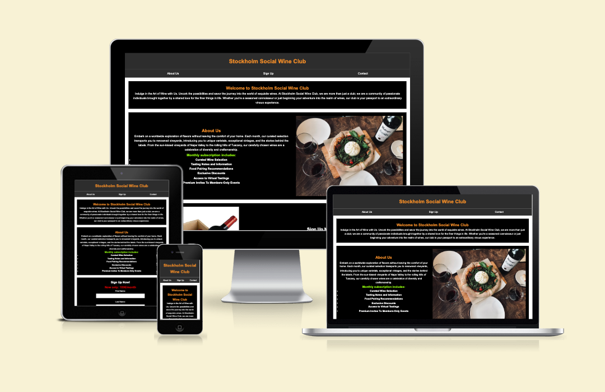
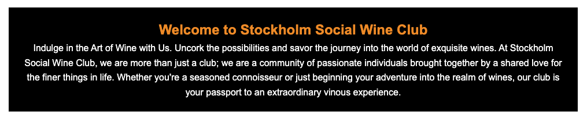
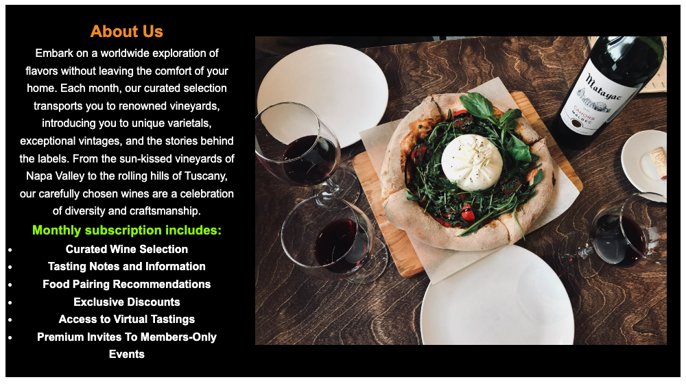
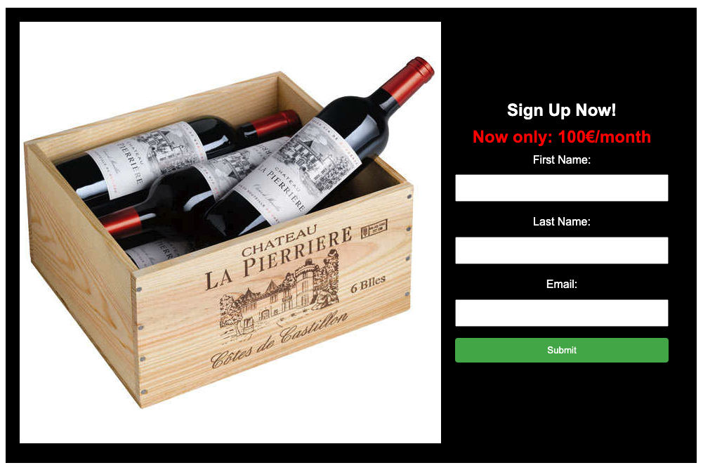

# Stockholm Social Wine Club
The Stockholm Social Wine Club webpage is a landing page for those who live , love and laugh for wine. The Stockholm Social Wine Club invites wine enthusiasts and novices alike to join a community bound by a shared passion for the world of exquisite wines. Our club is more than just a gathering; it's an exploration of flavors, a celebration of diversity, and a journey into the artistry of winemaking.

Users of this website will be able to get to know our concept and what we live for here in our Wine Club. They will find out all that they need to know about our passion and concept, pricing, contact information and a sign up form. This site is for:

Wine Enthusiasts: For those who appreciate the nuances of wine, whether you're a seasoned connoisseur or just starting your vinous journey.

Adventurous Palates: Ideal for individuals with a taste for exploration, eager to discover unique varietals and exceptional vintages.

Community Seekers: Perfect for those looking to connect with like-minded individuals, sharing experiences and insights on the world of wine.

Gift Givers: A thoughtful and unique gift for friends or family who have a love for wine and enjoy the excitement of monthly surprises.

Join the Stockholm Social Wine Club and uncork the possibilities of a vibrant wine community, where every bottle tells a story, and every sip is a journey!

___
## Features

* ### Navigation

* Featured at the top of the page, the heading shows the Club name in the middle:
 Stockholm Social Wine Club.
 
 * The navigation list is right under the heading: About us, sign up and Contact
  which link to different sections of the same page.
  
 * The navigation is in a standard font and a color that contrasts with the background.
  
 * The navigation clearly tells the user the name of the club and website and makes the different sections of informations easy to fint.
  
  
___
* ### The Header

* The header shows the name of the Club, using the color orange makes a great contrast to the black background.

* The header explains clearly what the site is based on and what kind of product we are promoting(Alcohole).

___
* ### The About Us Section

* The About Us section gives clear information of our philosophy and what the member will recieve when joining the Club.

* Gives them offers only a member can recieve.

___

* ### The sign Up Form

* The sign up section har a form to collect details from persons so the can sign up to the Stockholm Social Wine Club.

* The form collects the persons First name, Last name and an email adress.

* The sign up form is valuable to the user as it gives them ability to sign up tp join the Stockholm Social Wine Club and enter our magnificant community.
  

___

* ### The Contact Section

* The contact section encourage users to get in contact and provides a phone number and email adress.
  

___

* ### The Footer/Social media section

* The footer contains our
social media links that are provided with well-known icons that represent an external link and that open in a new window

___

* ## Testing
___
*